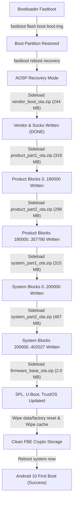

# Unisoc UIS8581A Head Unit: Unbrick & Recovery Deep Dive (Agent's Guide)

> **Audience**: AI Agents (Antigravity, Claude, Codex), Reverse Engineers, and Embedded Android Developers.  
> **Target SoC**: Unisoc / Spreadtrum UIS8581A (8-core A55, `uis8581a2h10_Automotive`)  
> **OS Version**: Android 10 (Kernel 4.14.133, `userdebug/test-keys`)  
> **Head Unit**: ZONGHENGTD / ZLH BMW E90 1920x720 12.3" Android Display  

---

## 1. Incident Overview & Problem Statement

### The Symptom
The head unit is stuck in an infinite bootloop to **Fastboot Mode**:
* The screen displays the BMW logo and `fastboot mode` in small red/white text.
* Command line reports: `0123456789ABCDEF fastboot`.
* Normal reboot (`fastboot reboot` or power cycle) returns immediately to Fastboot Mode.

#### Root Cause Analysis
1. **Bootloader Locking**:
   * The bootloader is locked (`androidboot.flash.locked=1`).
   * Bootloader verification checks Android Verified Boot (AVB 2.0).
   * In Fastboot, `fastboot flash system` or `fastboot flash super` fails because dynamic partitions reside inside `super` (`mmcblk0p33`), and standard bootloader fastboot does not support direct dynamic partition writing without custom tools.
   * `fastbootd` in userspace enforces device lock rules and rejects flashing on locked devices (`Flashing is not allowed on locked devices`).
2. **AVB Metadata Error (Result 6)**:
   * During the OTA 6.67 installation, the process was interrupted while modifying dynamic partitions.
   * `init` fails: `init: [libfs_avb]avb_slot_verify failed, result: 6`.
   * Result 6 is `AVB_SLOT_VERIFY_RESULT_ERROR_INVALID_METADATA`.
   * **Crucial clarification**: This error is caused by incomplete/invalid dynamic partition metadata (`system`, `product`, `vendor` inside `super` `mmcblk0p33`), **not** a corrupted hash of `boot`. Flashing `boot.img` was necessary to restore a clean kernel and recovery environment, but error code 6 persists until the dynamic partitions in `super` are fully rewritten.

---

## 2. Hardware & Architecture Constraints (The "Gotchas")

### Gotcha #1: "Apply update from SD card" CANNOT work via USB flash drive
* **Symptom**: In Recovery, selecting "Apply update from SD card" immediately displays:
  `Couldn't mount /storage/sdcard0`.
* **Root Cause**:
  * In `recovery.fstab`, `/storage/sdcard0` is hardcoded to `/dev/block/platform/soc/soc:ap-ahb/20300000.sdio/mmcblk1p1` (a physical MicroSD card slot on the PCB, unpopulated).
  * In Recovery, the Linux kernel sets the USB controller (`musb-hdrc.0.auto`) strictly to **Device / Peripheral mode** (`sys.usb.config=adb`, `extcon-gpio usb device true`).
  * The USB port **cannot act as a USB Host** while in Recovery mode. A USB flash drive will NEVER be detected or mounted in Recovery.
* **Solution**: You **MUST** use USB communication over a USB-A to USB-A cable connected between PC and **USB Port 1** of the head unit (via `adb sideload`).

### Gotcha #2: Fastboot/ADB Windows DLL Crash (`0xC0000142`)
* **Symptom**: Fastboot commands crash with `STATUS_DLL_INIT_FAILED (0xC0000142)`.
* **Root Cause**: Windows paths with spaces (e.g. `D:\BMW Dash\platform-tools`) break DLL dynamic loading for `AdbWinApi.dll`.
* **Solution**: Always use a space-free path: `C:\platform-tools\` or `D:\pt\`.

### Gotcha #3: Whole-File PKCS#7 Signature DER Offset and ASN.1 Attributes
* **Symptoms**:
  1. `E:Could not find signature DER block` (result 1, error 21).
  2. `E:failed to verify whole-file signature` (result 1, error 21).
* **Root Cause & Fixes**:
  1. **OpenSSL S/MIME attributes bug**: By default, `openssl smime -sign` includes signed MIME attributes (content type, signing time, message digest) inside the `signerInfo` structure. AOSP Recovery `verifier.cpp`'s `read_pkcs7()` implements a bare-bones recursive ASN.1 parser that expects the raw signature immediately after algorithm identifiers. Extra attributes disrupt the branch traversal, throwing `Could not find signature DER block`.  
     *Fix*: Added `-noattr` flag to `openssl smime -sign`.
  2. **Hash calculation range bug**: In AOSP `verifier.cpp`, `signed_len` is defined as:
     $$\text{signed\_len} = \text{length} - \text{comment\_len} - 2$$
     Older scripts signed `base_data + struct.pack("<H", comment_len)`. Including the 2-byte length field in the hash payload caused signature verification to fail.  
     *Fix*: Hash strictly `base_data` (excluding the 2-byte comment length).

### Gotcha #4: Sideload Buffer / Watchdog Aborts (>500 MB)
* **Symptom**: When sideloading packages >500 MB (e.g. `product_ota.zip` at 655 MB or `update.zip` at 1.9 GB), the transfer drops abruptly at 18–27% (`adb: failed to read command: No error`), and the head unit resets into Fastboot.
* **Root Cause**:
  * In Recovery FUSE streaming mode, large sequential memory reads exhaust kernel Page Cache (no swap).
  * Prolonged SHA-1 hashing over USB 2.0 starves the hardware watchdog timer (45–60s timeout without CAN bus heartbeat on bench).
* **Proven Solution**:
  * Keep all OTA packages **strictly below ~470 MB**.
  * Packages under ~470 MB transfer in <25 seconds, pass whole-file verification without watchdog bite, and write successfully to flash.
  * Verified on hardware: `vendor_boot_ota.zip` (244 MB) wrote 430 MB of `vendor` (`dm-0`) and 57 MB of `socko` drivers cleanly.

---

## 3. Storage & Partition Topology

### Physical eMMC Layout (`/dev/block/platform/soc/soc:ap-ahb/20600000.sdio/by-name/`)
* `mmcblk0boot0` (4 MiB): `spl` (U-Boot Secondary Program Loader)
* `mmcblk0boot1` (4 MiB): `spl_bk` (Backup SPL)
* `mmcblk0rpmb` (4 MiB): RPMB secure storage
* `mmcblk0p31`: `boot` (22 MB kernel + ramdisk)
* `mmcblk0p33`: `super` (Dynamic partitions container, ~4.3 GB)
* `mmcblk0p34`: `cache` (Recovery logs and wipe cache)
* Other physical partitions: `uboot`, `trustos`, `sml`, `teecfg`, `dtbo`, `socko` (kernel modules), `log`.

### Dynamic Partitions Layout (inside `super`)
* **Group**: `group_unisoc` (Maximum size: `4,299,161,600` bytes)
* **Partitions**:
  1. `system`: 1,650,896,896 bytes (402,027 blocks)
     - Sliced into: Part 1 (blocks `0..200000`, 315.8 MB) and Part 2 (blocks `200000..402027`, 467.8 MB).
  2. `product`: 1,465,466,880 bytes (357,780 blocks)
     - Sliced into: Part 1 (blocks `0..180000`, 319.2 MB) and Part 2 (blocks `180000..357780`, 298.4 MB).
  3. `vendor`: 429,965,312 bytes (104,972 blocks) — Packaged in `vendor_boot_ota.zip` (244 MB).

---

## 4. Complete Execution Sequence

---

## 5. Script Inventory in `recovery_unbrick/scripts/`

| Script | Purpose |
| :--- | :--- |
| **`sign_ota.py`** | Signs OTA ZIP using OpenSSL with `-noattr` and correct hash payload size (`length - comment_len - 2`). |
| **`verify_ota.py`** | Full Python implementation of AOSP `verifier.cpp` (ASN.1 structure, DER offset, SHA-1). |
| **`build_split_product.py`** | Splits `product.img` into `product_part1_ota.zip` and `product_part2_ota.zip` (<320 MB each). |
| **`build_split_system.py`** | Splits `system.img` into `system_part1_ota.zip` and `system_part2_ota.zip` (<470 MB each). |
| **`build_firmware_base.py`** | Builds 2 MB OTA with `SPL`, `uboot`, `trustos`, `sml`, `teecfg`, `dtbo`. |
| **`sideload_runner.py`** | Interactive runner: Fastboot -> Recovery transition, waits for user gesture, streams package with progress. |
| **`extract_partition_img.py`** | Converts `*.new.dat.br` + `*.transfer.list` into raw `.img` files. |
| **`recovery_diag.py`** | Diagnostic collector (dumps `dmesg`, `pstore`, `mounts`, `props`). |
